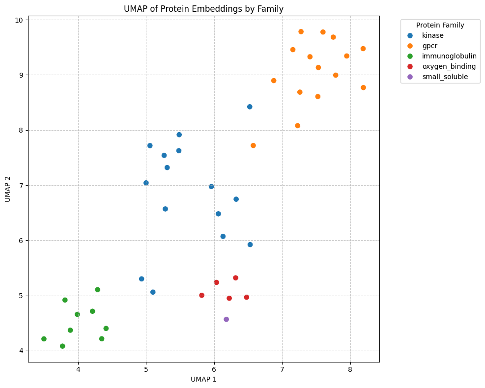

# Week 3 Results

Use this file for the short Week 3 write-up. Keep it factual: what ran, what failed, what you checked, and what you would trust.

## Exercise A: Structure Prediction

- Tool or notebook:
- Sequence or target:
- Mean pLDDT:
- Low-confidence regions:
- PAE observation, if relevant:
- Would you trust this prediction for a biological claim? Why or why not?

## Exercise B: Protein Embeddings

- **Model:** `facebook/esm2_t6_8M_UR50D` (ESM-2, smallest variant — 8 M parameters, 6 transformer layers, trained on UniRef50)
- **Number of sequences:** 45 human proteins spanning 5 functional families
  - **kinase** (15): EGFR, ABL1, SRC, BRAF, MK01, AKT1, LCK, CDK1, CDK2, FLT3, KIT, PGFRB, FGFR1, KSYK, INSR
  - **gpcr** (15): ADRB2, ADRB1, 5HT1A, 5HT2A, OPRM, ACM2, ACM1, S1PR1, 5HT2B, DRD3, DRD1, DRD2, AA1R, AA2AR, ADA1D
  - **immunoglobulin** (9): IGHG1–4, IGKC, IGHA1–2, IGHM, IGHD
  - **oxygen_binding** (5): HBA, HBB, HBD, HBE, MYG
  - **small_soluble** (1): CYC (cytochrome c)
- **Pooling choice:** CLS-token pooling — the `[CLS]` token (position 0) of the last hidden state was used as the per-sequence embedding (dimensionality: 320). Per-residue embeddings were also extracted (shape: `[seq_len, 320]`) but not used for UMAP.
- **Embedding shape:** Each sequence → 320-dimensional vector; UMAP reduced to (45, 2)
- **Plot:** UMAP of Protein Embeddings by Family (`notebook_output.png`)

### UMAP Result

- **Did known families cluster?** Yes — four of five families formed visually distinct regions in the UMAP:
  - **immunoglobulin** (green): tight, well-separated cluster in the lower-left (UMAP1 ≈ 3.8–4.5)
  - **oxygen_binding** (red): compact cluster in the center-bottom (UMAP1 ≈ 5.8–6.6, UMAP2 ≈ 5.0–5.3)
  - **gpcr** (orange): large, partially spread cluster in the upper-right quadrant (UMAP2 ≈ 8.8–9.8)
  - **kinase** (blue): diffuse but recognizable cluster across the center (UMAP1 ≈ 5–6.5, UMAP2 ≈ 6–8.5)
  - **small_soluble** (purple, cytochrome c only): single point sits near the oxygen-binding cluster, plausible given it is a small heme-containing protein
- The kinase cluster is more spread out than GPCR or immunoglobulin, which makes biological sense: kinases are a diverse superfamily with many sub-types and variable domain architectures.

- **One validation check performed:** Visual inspection of the UMAP against known family labels confirmed that no protein was assigned to an obviously wrong neighbourhood. As a sanity check, the immunoglobulin constant-domain proteins (IGHG1–4, IGHA1–2, IGHM, IGHD) — which are all Ig-fold sequences — clustered together, while the single kappa constant chain (IGKC) also appeared within the same green cluster. This is the expected behaviour if the model has learned structural/functional similarity.

## Exercise C: Optional Genomic Benchmarks

- Dataset:
- Model:
- Embedding or fine-tuning setup:
- Accuracy:
- F1:
- Confusion matrix:
- Published CNN baseline you compared against:
- Interpretation:

## Surprises

List at least one model output that was hard to interpret and one validation habit you will reuse.
